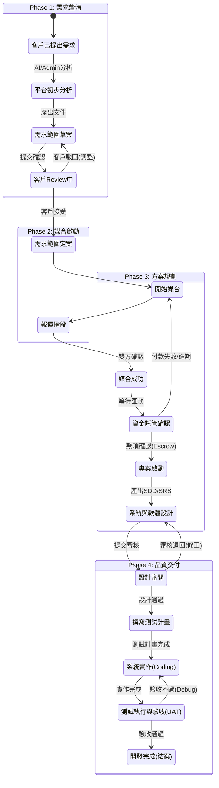

# 專案開發規劃（需求/流程/頁面）

本文件整理「專案開發」主題的流程設計、狀態管理、角色權限與頁面規劃，作為後續實作依據。

## 1. 目標與範圍

- 建立「專案需求 → 專案進度 → 文件管理」的完整流程雛形
- 支援不同角色（客戶、開發團隊、管理者）對狀態更新的權限
- 新增「專案列表頁」與「專案詳情頁」，可檢視狀態、文件與資訊

## 2. 角色與權限

角色：
- 客戶
- 開發團隊
- 管理者（可覆寫/調整任何狀態）

權限原則：
- 客戶：只能更新「客戶相關狀態」
- 開發團隊：只能更新「開發相關狀態」
- 管理者：可設定/更改任何狀態

## 3. 專案狀態模型

### 3.1 狀態總表（Phase → Status）

1) 需求釐清（AI + 客戶）
   - 客戶已提出需求（客戶）
   - 平台已初步分析需求（平台/管理者）
   - 需求範圍文件草案（平台/管理者）
   - 客戶 review 需求範圍（客戶）
   - 客戶調整需求（客戶）
   - 需求範圍文件完成（平台/管理者）

2) 媒合啟動（報價/選商）
   - 開始媒合（管理者）
   - 客戶出價（客戶）
   - 開發團隊出價（開發團隊）
   - 媒合成功（管理者）

3) 方案規劃（媒合後）
   - 資金託管確認（客戶/管理者）
   - 專案啟動（開發團隊）
   - 撰寫系統開發文件（開發團隊）
   - 撰寫軟體開發文件（開發團隊）
   - 文件審閱完成（客戶/管理者）

4) 品質交付
   - 撰寫測試計畫（開發團隊）
   - 系統實作中（開發團隊）
   - 測試執行與驗收（客戶/開發團隊）
   - 開發完成（開發團隊）

### 3.2 初始狀態

- 使用者新增專案後，預設狀態為「需求釐清 / 客戶已提出需求」

### 3.3 狀態屬性（建議欄位）

- `phase`: 需求初談 / 方案規劃 / 媒合啟動 / 品質交付
- `status`: 狀態名稱（如：客戶已提出需求）
- `role`: 可操作角色（customer / dev / admin）
- `sequence`: 狀態排序（用於流程排序與顯示）

### 3.4 狀態轉換關係表（嚴格順序 + 可退回）

狀態不可跳階，原則上只允許「目前狀態 → 下一個狀態」。  
但需保留「退回」路徑，避免真實流程卡死。

| 當前狀態 | 可前往狀態 |
| --- | --- |
| 客戶已提出需求 | 平台已初步分析需求 |
| 平台已初步分析需求 | 需求範圍文件草案 |
| 需求範圍文件草案 | 客戶 review 需求範圍 |
| 客戶 review 需求範圍 | 客戶調整需求 / 需求範圍文件完成 |
| 客戶調整需求 | 需求範圍文件草案 |
| 需求範圍文件完成 | 開始媒合 |
| 開始媒合 | 客戶出價 |
| 客戶出價 | 開發團隊出價 |
| 開發團隊出價 | 媒合成功 |
| 媒合成功 | 資金託管確認 |
| 資金託管確認 | 專案啟動 |
| 資金託管確認 | 開始媒合 |
| 專案啟動 | 撰寫系統開發文件 |
| 撰寫系統開發文件 | 撰寫軟體開發文件 |
| 撰寫軟體開發文件 | 文件審閱完成 |
| 文件審閱完成 | 撰寫測試計畫 |
| 撰寫測試計畫 | 系統實作中 |
| 系統實作中 | 測試執行與驗收 |
| 測試執行與驗收 | 開發完成 / 系統實作中 |

> 管理者可覆寫任何狀態，但仍建議記錄一筆狀態變更紀錄。

### 3.5 狀態切換條件（Guard Conditions）

狀態切換除了角色權限外，需加入條件檢查，避免「空流程」。

範例：
- 「撰寫系統開發文件」→「撰寫軟體開發文件」  
  條件：已上傳系統開發文件且狀態為 Approved。
- 「客戶 review 需求範圍」→「需求範圍文件完成」  
  條件：客戶已提交 Review 結果為 Accept。
- 「系統實作中」→「測試執行與驗收」  
  條件：已提交版本標記與變更摘要，且測試計畫已核准。
- 「資金託管確認」→「專案啟動」  
  條件：paymentStatus === "ESCROWED"。
- 「資金託管確認」→「開始媒合」  
  條件：paymentStatus === "FAILED" 或 "EXPIRED"（付款失敗/逾期）。

## 4. 頁面規劃

### 4.1 專案列表頁（Projects）

目的：瀏覽所有專案、快速掌握狀態  
內容：
- 專案名稱 / 客戶名稱 / 當前狀態 / 最近更新時間
- 篩選（狀態 / 角色 / 關鍵字）
- 新增需求按鈕（建立新專案）

### 4.2 專案詳情頁（Project Detail）

目的：查看單一專案的完整資訊  
內容區塊：
- 專案摘要（名稱、客戶、建立時間、目前狀態）
- 進度時間軸（Phase + Status，顯示可操作項目）
- 文件區（需求文件/系統開發/軟體開發/測試驗證）
- 討論/備註（可選，作為後續擴充）

### 4.3 新增需求頁（Create Project）

目的：建立專案與初始狀態  
輸入欄位：
- 專案名稱
- 需求摘要
- 客戶聯絡資訊
- 需求描述（可選）
補充功能：
- 「✨ AI 幫我完善需求」按鈕：將簡述轉成條列規格（需呼叫 AI 服務）

## 5. 資料模型建議

### 5.1 Project

- id
- name
- customerName
- contactInfo
- summary
- currentPhase
- currentStatus
- paymentStatus（PENDING / ESCROWED / RELEASED）
- isChangeRequest（預留，需求變更標記）
- createdAt
- updatedAt

### 5.2 ProjectStatusLog

- id
- projectId
- phase
- status
- updatedBy (user/role)
- updatedAt
- note (可選)

### 5.3 ProjectDocument（可選）

- id
- projectId
- type (需求文件/系統開發/軟體開發/測試驗證)
- title
- content / fileUrl
- updatedAt

### 5.4 ProjectDocumentHistory（建議）

每次文件更新都寫入一筆歷史紀錄，避免覆蓋造成資訊遺失。

- id
- documentId
- version
- fileUrl
- updatedBy
- updatedAt

### 5.5 文件儲存建議（Hybrid）

- 結構化內容（AI 可解析）：需求條列、驗收標準等，存資料庫（JSON）。
- 非結構化內容（人類閱讀）：附件、圖表、PDF，存 Cloud Storage，資料庫只存 URL。

## 6. 前後端互動（假設 API）

- `POST /projects` 建立新專案（初始狀態）
- `GET /projects` 專案列表
- `GET /projects/:id` 專案詳情
- `POST /projects/:id/status` 更新狀態（需權限 + Guard Conditions）
- `GET /projects/:id/status` 取得狀態紀錄

### 6.1 狀態切換 Payload（建議）

```json
{
  "nextStatus": "需求範圍文件完成",
  "guardData": {
    "documentId": "doc_12345",
    "reviewResult": "accept",
    "comment": "確認無誤，請進入媒合"
  }
}
```

## 7. 實作里程碑（建議）

1) 建立狀態常數與權限表
2) 建立專案列表頁（靜態資料）
3) 建立專案詳情頁（靜態資料）
4) 連接狀態切換（含 Guard Conditions 與退回路徑）
5) 加入文件區與歷史紀錄
6) 補上「測試執行與驗收 / 實作中」的 UI 流程

## 8. 待確認問題

- 角色來源：是否由 Firebase Auth 角色判斷？（待確認）
- 狀態切換是否必須嚴格順序（不可跳階）：是，需設計狀態轉換關係表並加入 Guard Conditions。
- 文件內容儲存方式：採 Hybrid（結構化 JSON + 非結構化檔案），需保留修改歷史紀錄。
- 是否需要「管理者審核」機制：建議初期需要（媒合成功/結案），後期可自動化。（待確認）
- 需求變更（CR）是否要獨立流程？（待確認）

## 9. 流程圖（Mermaid）


